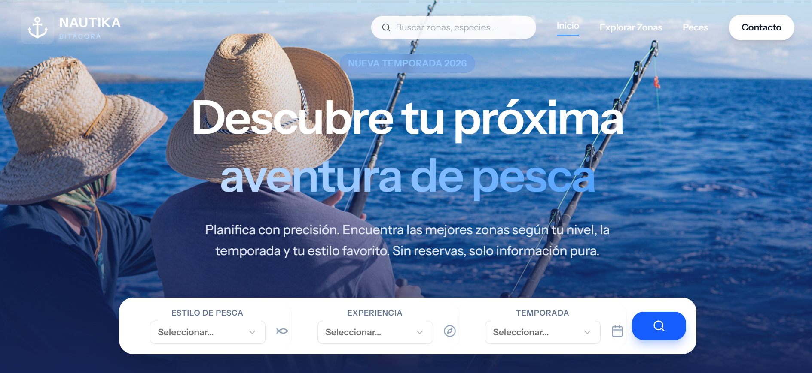
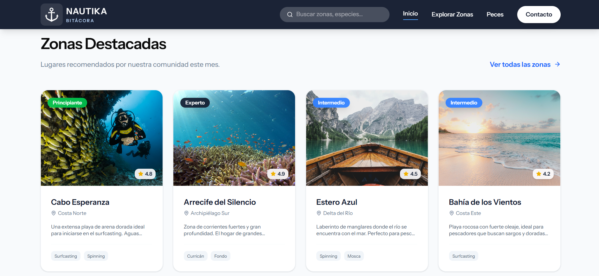
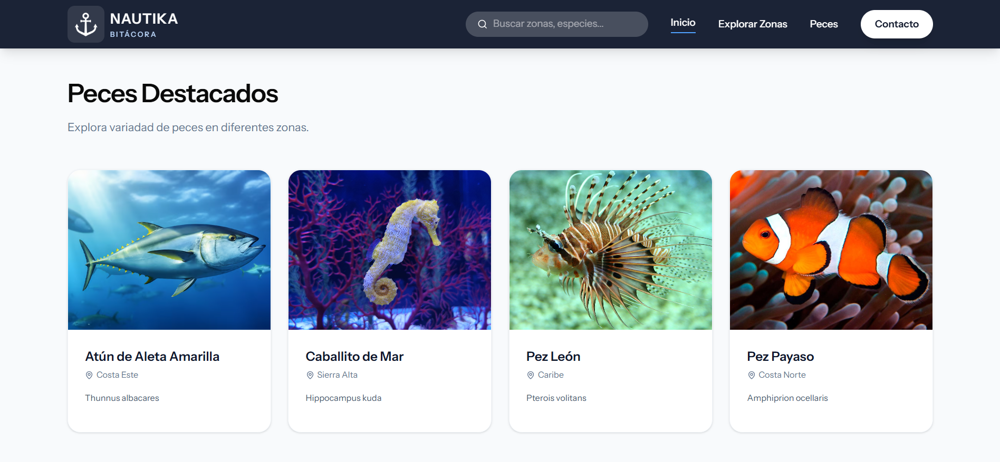
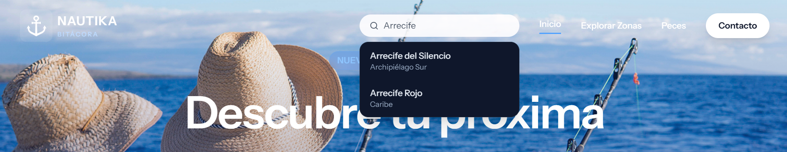
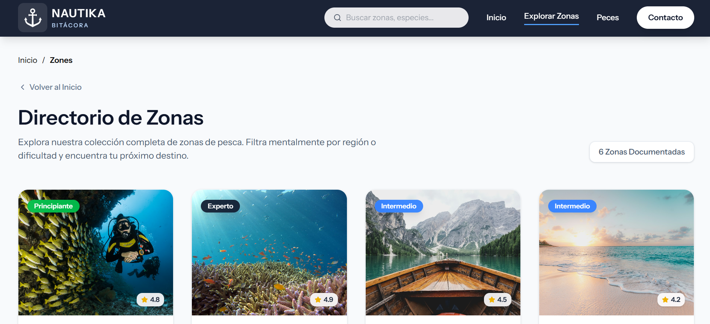
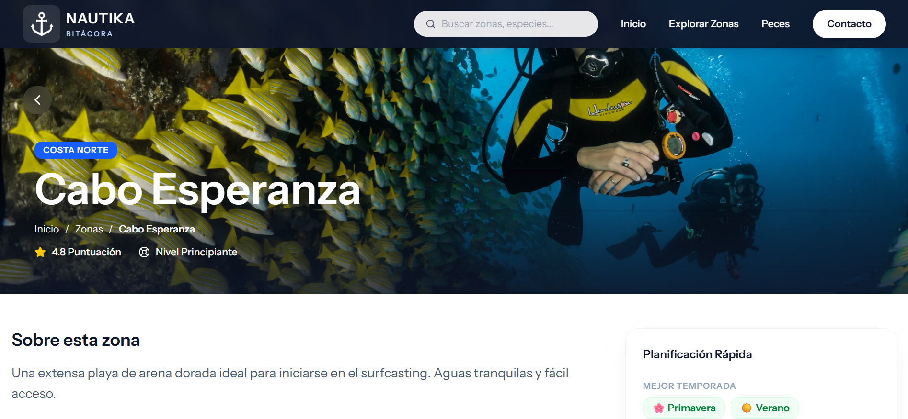

<div align="center">

# Nautika-Bitacora
**By Fausto Mendoza**


**Planificador inteligente de zonas de pesca para entusiastas y profesionales**

[Demo](#demo) • [Características](#características) • [Instalación](#instalación) • [Tecnologías](#tecnologías-utilizadas)

</div>

---

## Descripción

Nautika-Bitacora es una plataforma web informativa diseñada para ayudar a pescadores a planificar sus salidas de pesca de manera efectiva. La aplicación permite explorar y descubrir zonas de pesca óptimas basándose en múltiples criterios como la temporada del año, especies de peces disponibles y ubicaciones específicas.

### Objetivo

Proporcionar información accesible y organizada sobre zonas de pesca para facilitar la planificación de actividades pesqueras, mejorando la experiencia tanto de pescadores recreativos como profesionales.

---

## Características

### Búsqueda Avanzada de Zonas de Pesca
- **Filtrado por temporada**: Encuentra las mejores zonas según la época del año
- **Búsqueda por especies**: Localiza áreas donde se encuentran peces específicos
- **Búsqueda geográfica**: Explora zonas de pesca en ubicaciones determinadas

### Información Detallada
- Datos completos sobre cada zona de pesca
- Información sobre especies disponibles por temporada
- Características específicas de cada ubicación

### Interfaz Moderna
- Diseño responsivo y adaptable a cualquier dispositivo
- Navegación intuitiva y fluida
- Componentes UI construidos con shadcn/ui

### Sistema Informativo
- Plataforma completamente informativa (sin registro de usuario)
- Acceso libre a toda la información
- Enfoque en la experiencia del usuario

---

## Demo

### Capturas de Pantalla

**Página Principal**



**Zonas Destacadas**



**Especies Destacadas**



**Búsqueda con Autocompletado**



**Barra de Búsqueda**


**Lista de Zonas**



**Detalle de Zona**



---

## Tecnologías Utilizadas

### Backend
- **Laravel 11.x** - Framework PHP moderno y robusto
- **PHP 8.2+** - Lenguaje de programación del servidor

### Frontend
- **React 18** - Biblioteca JavaScript para construir interfaces
- **TypeScript** - Superset tipado de JavaScript
- **Inertia.js** - Adaptador para crear SPAs con Laravel
- **Vite** - Herramienta de construcción ultrarrápida

### UI/UX
- **Tailwind CSS** - Framework CSS utility-first
- **shadcn/ui** - Componentes reutilizables y personalizables
- **Lucide React** - Iconos modernos y elegantes

### Herramientas de Desarrollo
- **ESLint** - Linter para JavaScript/TypeScript
- **Prettier** - Formateador de código
- **Laravel Pint** - Formateador de código PHP
- **PHPUnit** - Testing para PHP

---

## Instalación

### Prerrequisitos

Asegúrate de tener instalado:
- PHP >= 8.2
- Composer
- Node.js >= 18.x
- NPM o Yarn
- MySQL/PostgreSQL (o base de datos de tu preferencia)

### Pasos de Instalación

1. **Clonar el repositorio**
```bash
git clone https://github.com/PJMP4826/Nautika-Bitacora.git
cd Nautika-Bitacora
```

2. **Instalar dependencias de PHP**
```bash
composer install
```

3. **Instalar dependencias de Node.js**
```bash
npm install
# o si usas yarn
yarn install
```

4. **Configurar variables de entorno**
```bash
cp .env.example .env
```

Edita el archivo `.env` y configura tu base de datos:
```env
DB_CONNECTION=pgsql
DB_HOST=127.0.0.1
DB_PORT=5432
DB_DATABASE=nautika_bitacora
DB_USERNAME=tu_usuario
DB_PASSWORD=tu_contraseña
```

5. **Generar key de la aplicación**
```bash
php artisan key:generate
```

6. **Ejecutar migraciones**
```bash
php artisan migrate
```

7. **Poblar la base de datos (opcional)**
```bash
php artisan db:seed
```

8. **Compilar assets**

Para desarrollo:
```bash
# Iniciar servidor de desarrollo (Laravel y Vite)

composer run dev

# Iniciar servidor de desarrollo (Vite)
npm run dev
```

Para producción:
```bash
npm run build
```

9. **Iniciar el servidor de desarrollo**
```bash
php artisan serve
```

La aplicación estará disponible en `http://localhost:8000`

---

## Estructura del Proyecto

```
Nautika-Bitacora/
├── app/                        # Lógica de la aplicación Laravel
│   ├── Enums/                 # Enumeraciones (WaterType)
│   ├── Http/
│   │   ├── Controllers/       # Controladores de la aplicación
│   │   ├── Middleware/        # Middlewares personalizados
│   │   ├── Requests/          # Form Requests
│   │   └── Resources/         # API Resources
│   ├── Interfaces/            # Interfaces de repositorios
│   ├── Models/                # Modelos Eloquent
│   ├── Repositories/          # Implementación de repositorios
│   ├── Services/              # Lógica de negocio
│   └── Utils/                 # Utilidades y helpers
├── database/
│   ├── migrations/            # Migraciones de base de datos
│   ├── seeders/              # Seeders para datos iniciales
│   └── factories/            # Factories para testing
├── resources/
│   ├── js/                   # Código TypeScript/React
│   │   ├── actions/          # Acciones del frontend
│   │   ├── components/       # Componentes React
│   │   │   ├── features/    # Componentes de características
│   │   │   ├── layout/      # Componentes de layout
│   │   │   └── ui/          # Componentes UI reutilizables
│   │   ├── pages/           # Páginas de Inertia
│   │   ├── routes/          # Definición de rutas frontend
│   │   └── types/           # Tipos de TypeScript
│   ├── css/                 # Estilos CSS
│   └── views/               # Vistas Blade
├── routes/
│   └── web.php              # Rutas de la aplicación
├── public/                   # Archivos públicos y assets compilados
└── tests/                    # Tests unitarios y de integración
```

---

## Comandos Útiles

### Desarrollo
```bash
# Iniciar servidor de desarrollo (Laravel y Vite)

composer run dev

# Iniciar servidor de desarrollo (Laravel)
php artisan serve

# Compilar assets en modo desarrollo (Vite con hot reload)
npm run dev

# Formatear código PHP
./vendor/bin/pint

# Formatear código JavaScript/TypeScript
npm run format

# Ejecutar linter
npm run lint
```

### Testing
```bash
# Ejecutar tests PHP
php artisan test

# o con PHPUnit
./vendor/bin/phpunit
```

### Producción
```bash
# Compilar assets para producción
npm run build

# Optimizar la aplicación
php artisan optimize

# Limpiar caché
php artisan cache:clear
php artisan config:clear
php artisan route:clear
php artisan view:clear
```

---

## Navegadores Soportados

- Chrome (últimas 2 versiones)
- Firefox (últimas 2 versiones)
- Safari (últimas 2 versiones)
- Edge (últimas 2 versiones)

---

## Contribuciones

Las contribuciones son bienvenidas. Para contribuir:

1. Haz fork del proyecto
2. Crea una rama para tu feature (`git checkout -b feature/NuevaCaracteristica`)
3. Realiza tus cambios y haz commit (`git commit -m 'Add: nueva característica'`)
4. Sube los cambios (`git push origin feature/NuevaCaracteristica`)
5. Abre un Pull Request

---

## Convenciones de Código

Este proyecto sigue las convenciones estándar de:
- [PSR-12](https://www.php-fig.org/psr/psr-12/) para código PHP
- [Airbnb JavaScript Style Guide](https://github.com/airbnb/javascript) para TypeScript/React

---

## Roadmap

### Próximas Funcionalidades
- [ ] Sistema de autenticación de usuarios
- [ ] Guardar zonas de pesca favoritas
- [ ] Sistema de comentarios y valoraciones
- [ ] Integración con servicios meteorológicos
- [ ] Filtros avanzados de búsqueda
- [ ] Exportación de planificaciones en PDF
- [ ] Modo oscuro

---

## Autores

- **PJMP4826** - *Desarrollo inicial* - [GitHub](https://github.com/PJMP4826)

---

## Licencia

Este proyecto está disponible como código abierto.

---

## Contacto

Para preguntas o sugerencias:
- faustojaviermendozaperez.tareas@gmail.com

---

## Agradecimientos

- Laravel Framework
- shadcn/ui por los componentes
- Comunidad de código abierto

---

<div align="center">

Hecho con dedicación por [PJMP4826](https://github.com/PJMP4826)

</div>
